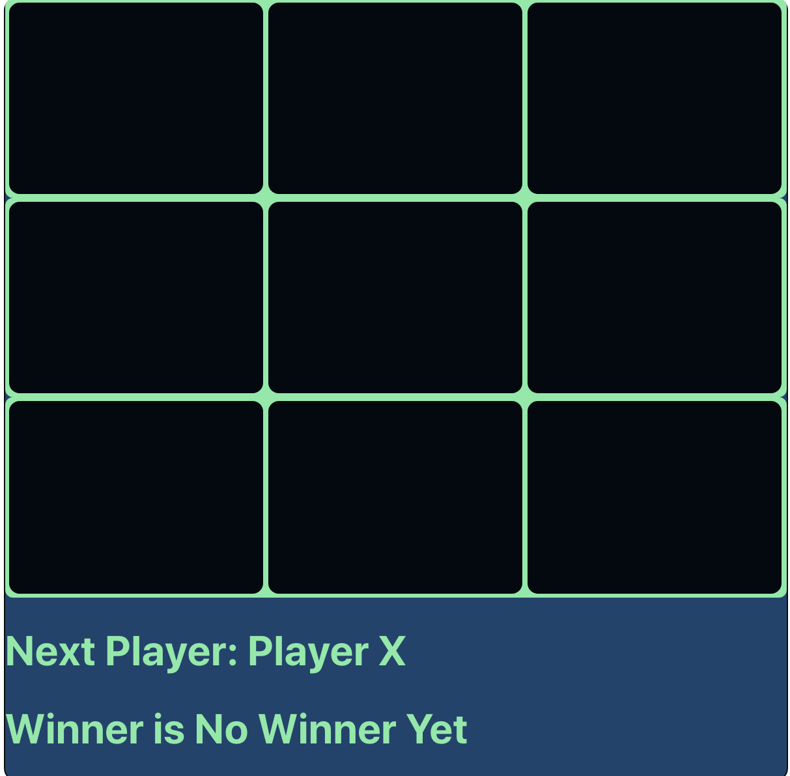
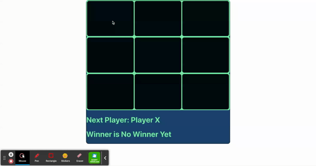

# tic-tac-toe game
  Play a traditional tic-tac-toe game in which 2 players try to win by making a stright line by putting their symbol (x / O) on the cells
  in alternative turns.

**What I Learned**
- How to use react hooks useState
- How to pass state between parent and child componenets

**tic-tac-toe**

## Description
- It allows two players to play . Player 1 is 'X' and Player 2 is 'O'
- As soon as the Player click the cell it displays that players symbol on the Square and the next player turn on the Board
- Board is the parent and Square is the child.
- When one player wins by putting their symbol in a row then the board displays the Winner.

## Improvements
- Right now , it gives the chance to click the same Square several times . So, Once the square is clicked by one player it must be disabled so that no other player will click again. (implemented)
- Right now , it allows one to play though it announced the winner. So, disabling all the squares is must once the winner is announced.
- It would be better if there is a way to restart the game.

## Installation
- Download this project in your working directory through, \
git clone https://github.com/vanisbala/react-tictactoe-game
- cd into the new folder and type
$ npm install
it will install the required dependencies.
- To run the react project
$ npm start
- You can add new actions are delete the existing actions in the list.
- You can also modify the project to immit nclude new features.

**Demo** \

## Built with
- [HTML](https://developer.mozilla.org/en-US/docs/Web/HTML)
- [CSS](https://developer.mozilla.org/en-US/docs/Web/CSS)
- [JavaScript](https://developer.mozilla.org/en-US/docs/Web/Javascript)
- [React](https://reactjs.org/)

## Deployed Link
- [See live Site](https://vanisbala.github.io/react-tictactoe-game/)

## Author
### Vani 
- [Link to Github](https://github.com/vanisbala)

## Credits
Thanks to MITxPRO for giving me the opportunity to work on this simple react project.

